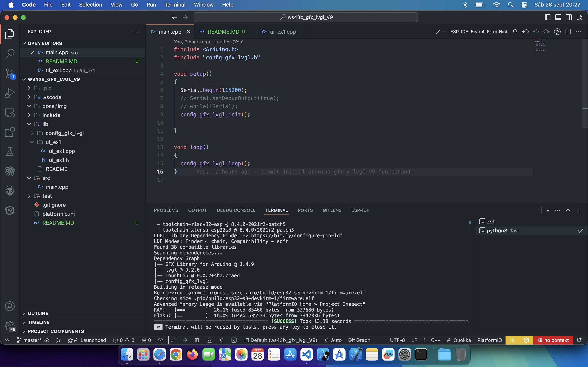
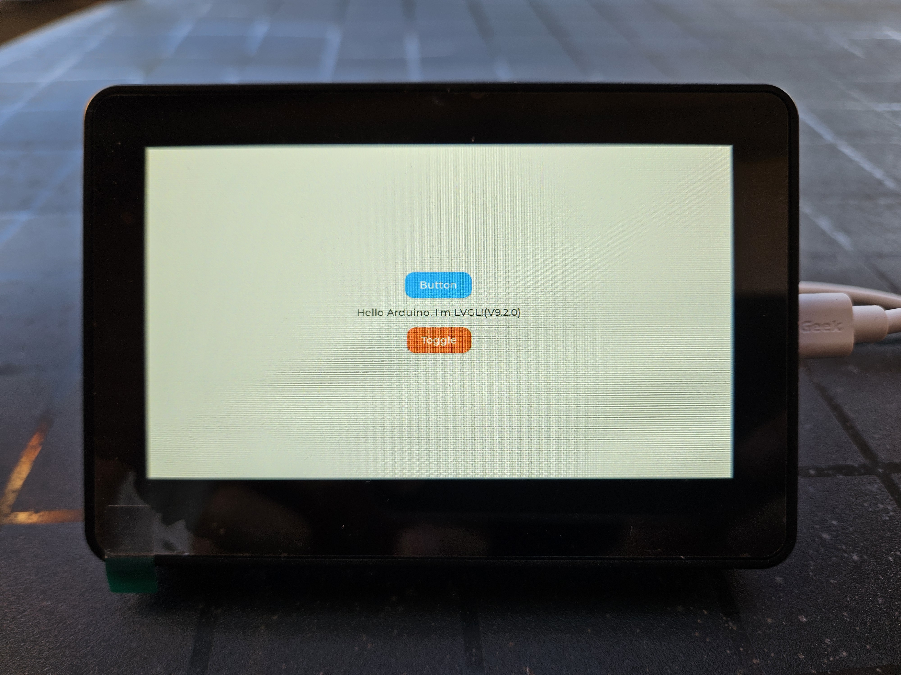

# Waveshare Esp32-s3-touch-lcd-4.3b

Este repositorio pretende ser un estudio/juego de la librería [LVGL](https://lvgl.io) con el framework Arduino en un [esp32-s3-touch-lcd-4.3b](https://www.waveshare.com/esp32-s3-touch-lcd-4.3b.htm).  

En esta herramienta de desarrollo, para usar la librería lvgl son necesarias librerias gráficas para el TFT con el controlador ST7262 y de panel táctil con el controlador GT911.

En la documentación oficial usan [ESP32_Display_Panel](https://github.com/esp-arduino-libs/ESP32_Display_Panel.git) pero yo quería usar [Arduino GFX](https://github.com/moononournation/Arduino_GFX) que tiene un ejemplo para usar con [lvgl V9](https://github.com/moononournation/Arduino_GFX/tree/master/examples/LVGL/LVGL_Arduino_v9).

Me encontré con este [repositorio](https://github.com/Westcott1/Waveshare-ESP32-S3-Touch-LCD-4.3-and-Arduino) que me ha permitido empezar este proyecto. ¡¡¡ Viva el opensource !!!

> [!NOTE]
> Intalar correctamente la librería lvgll en la carpeta .pio tal y como se describe en la [documentación](https://docs.lvgl.io/9.2/integration/framework/arduino.html)

